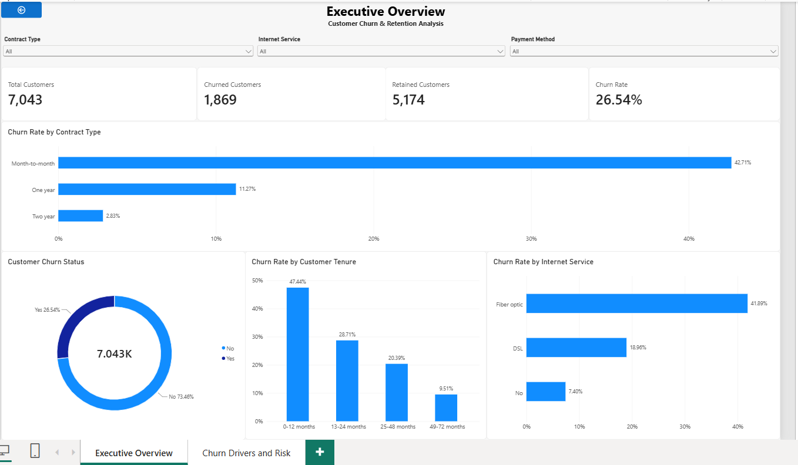
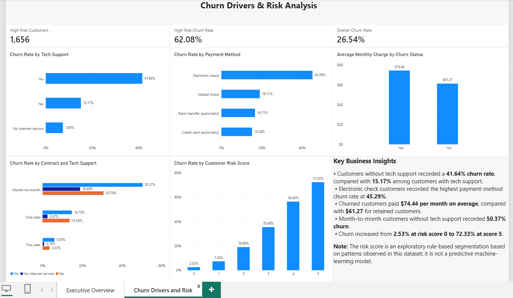

# Customer Churn & Retention Analysis

## Project Overview

Customer churn is an important business challenge for subscription-based companies because retaining existing customers can be critical to maintaining recurring revenue and long-term growth.

This project analyses the IBM Telco Customer Churn dataset containing **7,043 customers** to identify customer characteristics associated with churn and highlight segments that may benefit from targeted retention strategies.

The analysis was completed across **Python, MySQL, and Power BI**, demonstrating an end-to-end data analytics workflow from data cleaning and exploratory analysis to SQL-based business analysis and interactive dashboard development.

### Business Questions

The project investigates the following questions:

- What is the overall customer churn rate?
- How does churn vary by contract type and customer tenure?
- Is internet service type associated with different churn rates?
- How does tech support relate to customer churn?
- Which payment methods are associated with higher churn?
- Do churned customers have different monthly charges from retained customers?
- Which combinations of customer characteristics are associated with particularly high churn?
- Can customers be grouped into exploratory risk segments based on multiple churn-related characteristics?

## Tools & Technologies

- **Python** — Data cleaning, exploratory data analysis, churn analysis, customer risk segmentation, and visualisation using Pandas and Matplotlib.
- **MySQL** — Data quality checks, aggregation, customer segmentation, and SQL-based analysis of churn patterns.
- **Power BI** — Interactive dashboard development, KPI reporting, DAX measures, customer segmentation, and visualisation of key churn drivers.
- **Jupyter Notebook** — Development and documentation of the Python analysis.
- **MySQL Workbench** — SQL database management and query development.
- **GitHub** — Project documentation and portfolio presentation.

## Project Workflow

The project followed an end-to-end analytics workflow:

1. **Data Preparation** — Imported the customer churn dataset and reviewed its structure, data types, missing values, and duplicates.
2. **Data Cleaning** — Converted `TotalCharges` to a numeric field while retaining 11 new customers whose original values were blank.
3. **Exploratory Data Analysis** — Examined customer characteristics and overall churn patterns.
4. **Churn Driver Analysis** — Analysed churn across contract type, tenure, internet service, tech support, payment method, and monthly charges.
5. **Customer Risk Segmentation** — Created an exploratory rule-based risk score using multiple characteristics associated with churn in the dataset.
6. **SQL Analysis** — Reproduced and extended the business analysis in MySQL using aggregation, conditional logic, and customer segmentation.
7. **Power BI Dashboard** — Developed a two-page interactive dashboard covering executive KPIs, churn drivers, and customer risk.
8. **Business Recommendations** — Translated the analytical findings into retention-focused areas for further investigation and testing.

## Key Findings

### 1. Overall Customer Churn

- The dataset contains **7,043 customers**.
- **1,869 customers churned**, while **5,174 customers were retained**.
- The overall customer churn rate was **26.54%**.

### 2. Contract Type

Contract type showed a strong association with customer churn:

- **Month-to-month:** 42.71%
- **One-year contract:** 11.27%
- **Two-year contract:** 2.83%

Customers on month-to-month contracts had substantially higher churn than customers on longer-term contracts.

### 3. Customer Tenure

Churn was highest among customers earlier in their relationship with the company:

- **0–12 months:** 47.44%
- **13–24 months:** 28.71%
- **25–48 months:** 20.39%
- **49–72 months:** 9.51%

This pattern suggests that the early customer lifecycle is an important area for retention analysis and intervention testing.

### 4. Internet Service

Churn varied considerably across internet service types:

- **Fiber optic:** 41.89%
- **DSL:** 18.96%
- **No internet service:** 7.40%

Fiber-optic customers had the highest observed churn rate, indicating that their pricing, service experience, and other characteristics warrant further investigation.

### 5. Tech Support

Customers without tech support experienced considerably higher churn:

- **No tech support:** 41.64%
- **Tech support:** 15.17%
- **No internet service:** 7.40%

Among month-to-month customers without tech support, churn reached **50.37%**.

### 6. Payment Method

Electronic check customers recorded the highest churn rate among payment methods:

- **Electronic check:** 45.29%
- **Mailed check:** 19.11%
- **Bank transfer (automatic):** 16.71%
- **Credit card (automatic):** 15.24%

### 7. Monthly Charges

Churned customers also had higher average monthly charges:

- **Churned customers:** $74.44
- **Retained customers:** $61.27
- **Difference:** $13.17

These results show an association between higher monthly charges and churn, although the analysis does not establish that higher charges directly cause customers to leave.

### 8. Exploratory Customer Risk Segmentation

A rule-based risk score was created using five characteristics associated with higher churn in the dataset:

- Month-to-month contract
- Tenure of 12 months or less
- Fiber-optic internet service
- No tech support
- Electronic check payment

Observed churn increased as the number of risk characteristics increased:

| Risk Score | Churn Rate |
|---:|---:|
| 0 | 2.53% |
| 1 | 7.34% |
| 2 | 18.99% |
| 3 | 35.46% |
| 4 | 56.42% |
| 5 | 72.33% |

Customers with scores of **4–5** were classified as the exploratory **High Risk** segment. This group contained **1,656 customers** and had an observed churn rate of **62.08%**.

> **Note:** The risk score is an exploratory rule-based segmentation developed from patterns observed in this dataset. It is not a predictive machine-learning model and would require validation on unseen data before being used for prediction.

## Business Recommendations

Based on the observed churn patterns, the following areas could be prioritised for further investigation and retention testing:

### 1. Strengthen Early-Customer Retention

Customers within their first 12 months had the highest tenure-based churn rate at **47.44%**.

The business could test enhanced onboarding, proactive check-ins, and early customer-support initiatives during the first year to determine whether these interventions improve retention.

### 2. Review the Month-to-Month Customer Experience

Month-to-month customers recorded a **42.71% churn rate**, compared with 11.27% for one-year and 2.83% for two-year contracts.

The company could investigate why customers remain on month-to-month plans and test appropriate incentives or benefits for customers interested in longer-term contracts.

### 3. Investigate Fiber-Optic Customer Churn

Fiber-optic customers had a **41.89% churn rate**, substantially higher than DSL customers at 18.96%.

Further analysis should examine factors such as pricing, service quality, customer support, and customer characteristics to understand what may be contributing to this pattern.

### 4. Evaluate Tech-Support Retention Initiatives

Customers without tech support had a **41.64% churn rate**, compared with **15.17%** among customers with tech support.

The company could test whether improved access to technical support, proactive assistance, or targeted support offers are associated with improved retention.

### 5. Investigate Electronic-Check Customers

Customers paying by electronic check had the highest payment-method churn rate at **45.29%**.

Rather than assuming the payment method itself causes churn, the company should investigate the characteristics and experiences of this customer segment and test whether payment-related improvements or alternative payment options affect retention.

### 6. Prioritise Customers with Multiple Risk Characteristics

The exploratory risk analysis showed that churn increased from **2.53% at risk score 0** to **72.33% at risk score 5**.

Customers displaying several observed risk characteristics could therefore be prioritised for retention experiments, while the effectiveness of those interventions should be measured before wider implementation.

## Power BI Dashboard

The Power BI report provides an interactive view of customer churn, combining executive-level KPIs with detailed analysis of churn drivers and customer risk.

### Executive Overview

The Executive Overview summarises the overall customer base and highlights churn patterns across contract type, customer tenure, and internet service.



### Churn Drivers & Risk Analysis

The second dashboard examines key churn-related characteristics including tech support, payment method, monthly charges, contract and support combinations, and the exploratory customer risk score.



## Repository Structure

```text
customer-churn-retention-analysis/
│
├── data/
│   └── Telco-Customer-Churn.csv
│
├── python/
│   └── customer_churn_analysis.ipynb
│
├── sql/
│   └── customer_churn_analysis.sql
│
├── powerbi/
│   └── customer_churn_analysis.pbix
│
├── images/
│   ├── executive_overview.png
│   └── churn_drivers_and_risk_analysis.png
│
└── README.md
```

### How to Explore This Project

- **Python Analysis:** Open `python/customer_churn_analysis.ipynb` to review the data cleaning, exploratory analysis, visualisations, and customer risk segmentation.
- **SQL Analysis:** Open `sql/customer_churn_analysis.sql` to review the MySQL queries used to analyse churn patterns and customer segments.
- **Power BI Dashboard:** Open `powerbi/customer_churn_analysis.pbix` in Power BI Desktop to explore the interactive dashboard.
- **Dashboard Preview:** The dashboard screenshots above provide a quick view of the final Power BI report without requiring Power BI Desktop.
- **Dataset:** The source dataset used for the analysis is stored in the `data` folder.
